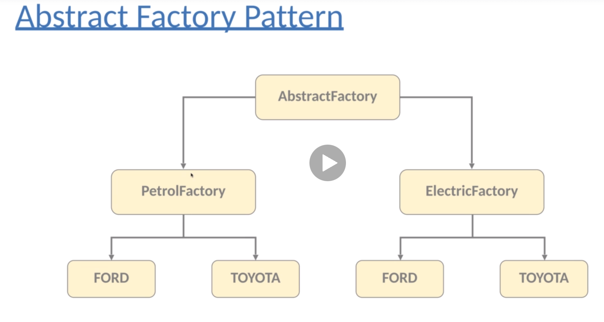
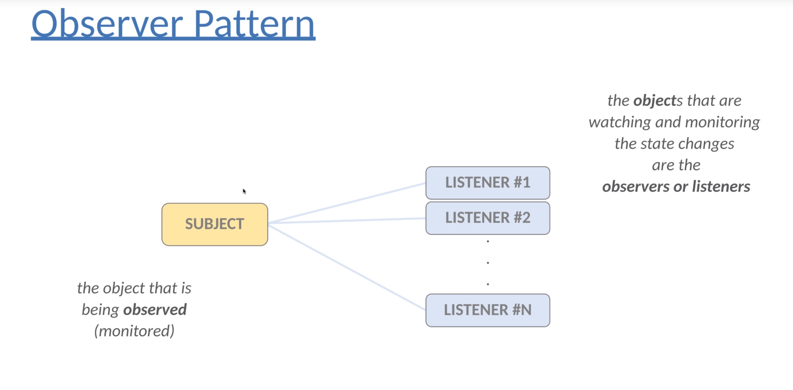

# Design Patterns
Design Principles (such as SOLID) are high level guidelines to design reusable software applications. Design principles are programming language and platform independent. 
Design Patterns are low level solutions of frequent object oriented related problems.
Design pattern is the concrete implementation. Design patterns tested by others - these techniques are state-of-the-art problem specific solutions.
Design principles allow scalable and maintainable software architectures. Design patterns are more about how to design your code and concrete implementations of the design principles. 

## Creational Design Patterns
Creational patterns provide various object creation mechanisms which increase flexibility and reuse of existing code.
### Singleton Pattern
* Singleton pattern is a creational Design Pattern.
* Singleton lets you ensure that a class has only one instance while providing a global access point to that given instance.
* It ensures that given class has just single instance.
* Singleton pattern is easy to implement , it can become complex when multiple Threads/Process access the same instance.

##### When to Use ?
* Control Access to shared resources such as files, databases or Thread pools.
* It is extremely crucial for Logging.

#### Code Demonstration
* com.suraj.creational.singleton package contains 2 implementation of Singleton pattern.
* DatabaseConnector class leverage Private Constructor with static getInstance method. GetInstance method has Synchronized block that blocks multiple Threads to create multiple instances. 
* DatabaseConnector class is not 100 % safe as multiple instance can be created through "Reflection Attack". Also, the Synchronized blocks are slower.
* Database class leverage Enum to create Singleton object of Database class.
* Database is 100% Thread safe as the Enums are Compile time constants.

### Factory Pattern
* Factory pattern helps to create loosely coupled OOP design.
* There is fundamental problem with new Keyword. We should favour abstraction (supertypes) instead of concrete implementations.
* Whenever we use new keyword (instantiate a class ), we definitely violate this principle.
* Trying to code to concrete classed makes the application fragile and less flexible.
* If we program to Interface - the code will work fine with any other classes implementing that interface

    Animal dog = AnimalFactory.getDog()
    
* We can instantiate the classes in a separate class - Factory. 
* We should separate static classes in the application from the classes that change frequently.

#### Code Demonstration
* com.suraj.creational.factory package has AnimalFactory class that contains the logic to instantiate and return Object of type Animal based on the type of animal passed.
* Factory lets you add new Implementation of Animal types without introducing new keyword for each of new implementation of Animal Interface i.e., BobCat().
* We don't expose the creation logic to the client and refer created object using a standard interface.

### Abstract Factory Pattern
* Abstract Factory pattern helps to other factories ( factories of factories).
* It is an interface responsible for creating a factory of related objects without explicitly specifying their classes.
* Abstract factory create factory pattern , it is producing families of related objects.

Abstract factory lets you create a Petrol Factory or an Electric Factory. Petrol factory will produce Petrol cars and Electric factory will produce Electric cars.
#### Code Demonstration
* com.suraj.creational.abstractfactory package has 2 Factory classes for assembling Electric cars and Petrol Cars. 
* FactoryProducer class create the Car factory based on the Type of factory.

### Builder Pattern
* Builder Pattern is maybe the #1 design pattern in software engineering.
* Main motivation behind builder pattern ? Classes with large number of variables, there may be a large amount of parameters in a constructor, several instance variables in a given class, easy to confuse parameters.
* Telescoping constructors - If we have to add another optional parameter to  then we have to add another constructor. This results in multiple constructors calling constructor from one to another.
* With Builder pattern satisfies the immutable property. Object created at the last step,
  
  Person p = new Person.Builder().setAge(10),setName("Kevin").build(); 

  
* There can not be any problem because of concurrent updates - when dealing with multiple threads or processes.

#### Code Demonstration
* com.suraj.creational.builder package has 2 implementation of Builder pattern - Student and Person.
* Builder pattern achieved by creating static inner class Builder that all the required parameter to be initialized by passing them to constructor and optional parameter by having setter functions.

### Prototype Pattern
* Aim is to copy existing objects without depending on those given classes.
* Delegate the object creation problem to the object itself - Cloning.
* An Object that support closing operation called a prototype.
* In Java, we have to implement Cloneable interface and define clone() method.
#### Code Demonstration
* com.suraj.creational.prototype package contains a simple example of Prototype pattern.

## Behavioral Design Patterns
In Software engineering behavioral design pattern are pattern that identify common communication patterns between object. These patterns increase flexibility in carrying out the communication.

### Strategy Pattern
* Strategy pattern (or policy pattern) enable selecting an algorithm at run time.
* Define a family of algorithm, put each of them into a separate class and make their objects interchangeable.
  * Strategy Pattern based on following principles,
  Encapsulate what is changing - Encapsulation is an important concept in OOP. Consider the classes and methods that varies and encapsulate it. Later we can change or update parts of application that change frequently without affecting the static parts.
    
  * Program to Supertype - Actual Run time object should not be locked into the code. Type of variable should be abstract(interface or abstract).
  * Favor Composition over Inheritance - Gives more flexibility and you change behavior at run time.
  
#### Code Demonstration
* com.suraj.behavioral package contains Strategy interface this ensures Open/closed principle not violated.
* OperationsManager class acts as abstraction layer between the high level modules and low level modules  

### Observer Pattern
* Observer pattern defines one-to-many dependency between object or entities.
* When one object changes state all of its dependents are notified and updated automatically.
* Subject is the Object that being monitored and observers (or listeners) are dependent on the subject.
* Help in achieving loosely couple software systems.
* When 2 objects loosely coupled they can interact but they little knowledge of each other. 
* Only thing subject knows about an observer is that it implements a certain interface.
* We can add observers whenever we want - just have to implement the Observer interface. We can change Subject or observer independently.

#### Code Demonstration
* com.suraj.behavioral.observer package contains simple implementation of Observer pattern with Weather Station as Observer and WeatherObserver as an Observer.
* com.suraj.behavioral.observer.stock package contains stock exchange simulator program. StockExchange class generates random values of stock prices. Trader is the observer interface , it has 2 implementation classes.

### Command Pattern
* Aim is to achieve separation of concerns. Command layer acts as abstract layer and helps in achieving loose coupling.
* User interface component knows nothing about the underlying business logic or the model.
* There are 4 component of command pattern - command, receiver, invoker and client,
  * Command : It knows about receiver and invokes a method of the receiver. Value for parameters of the receiver method stored in the command.
  * Receiver : Its does the work itself.
  * Invoker : Knows how to execute a command and optionally does bookkeeping about command execution. Invoker does not know anything about concrete command , it knows only about command interface.
  * Client : Client decides which commands to execute. To execute a command it passes the command object to the invoker object.
  
* Advantages :
  * Loosely coupled Design and Single Responsibility : We can decouple classes that invoke the operation, and the classes that will execute the operation.
  * Open/Closed Principle : We can add commands without modifying existing code.
  * Implement Undo/Redo Operations : We do not have to execute the commands immediately - we can store the commands in the data structure.
  

#### Code Demonstration
* com.suraj.behavioral.command package has the simple implementation of Command Pattern.
* Light Class acts as a Receiver, Command Interface has only one method execute.
* There are 2 commands implementation created - TurnOnCommand and TurnOffCommand.
* Switcher class acts as Invoker which contains methods to add and execute commands. Note the Switcher class has no knowledge of how Lights will be turned on/off, it knows only about Command interface - execute method.

### Iterator Pattern
Iterator pattern is very commonly used design pattern in Java. This is used to get a way to access the element of a collection object in sequential manner without any need to know its underlying representation.

#### Code Demonstration
* com.suraj.behavioral.iterator package contains a NameIterator class that implements the Iterator interface.
* Iterator interface has 2 methods - next() and hasNext().
* NameRepository class uses the Name Iterator to read list of names.

### Template Pattern
#### Code Demonstration
#### Key Benefits

### Null Object Pattern
#### Code Demonstration
#### Key Benefits

### Visitor Object Pattern
#### Code Demonstration
#### Key Benefits

## Structural Design Patterns

### Decorator Pattern
#### Code Demonstration
#### Key Benefits

### Facade Pattern
#### Code Demonstration
#### Key Benefits

### Flyweight Pattern
#### Code Demonstration
#### Key Benefits

### Adapter Pattern
#### Code Demonstration
#### Key Benefits

